# Implementation Plan — KisanShield

**Parametric Crop Insurance with Automatic Payout (PS3)**

| | |
|---|---|
| Document | Implementation Plan |
| Version | 1.2 |
| Status | Approved — Phase 0; restructured into eight coding phases; P9 post-MVP backlog added |
| Last updated | 2026-09-09 |
| Budget | ~15 hours, solo developer |
| Task status mirror | [TRACKER.md](../TRACKER.md) — task IDs must match exactly |
| Review model | **Eight coding phases, each ending at a hard stop for user review** — see [Phase review gate](#phase-review-gate) |

---

## Milestones

| ID | Milestone | Definition of done | Cumulative |
|---|---|---|---|
| M0 | **Planning complete** | Eight documents written, reviewed, approved | 0h |
| M1 | **Contract pays out** | `CropInsurance.sol` deployed locally; a funded policy pays automatically on agreeing sub-threshold readings; full test suite green | ~5h — end of P3 |
| M2 | **Oracle simulation drives it** | Two independent feeds submit from distinct addresses, reading from the Supabase mock dataset; all three demo scenarios reproducible on command | ~7.5h — end of P5 |
| M3 | **Farmer can read the ledger** | Public `/policy/:id` renders terms, readings vs threshold, and a plain-language ledger with zero wallet involvement | ~11h — end of P7 |
| M4 | **Demo-ready** | Insurer console operational; error and loading states complete; full demo script runs cold | ~14.5h — end of P8 |

M1 alone is a demonstrable product. Every milestone after it is genuinely additive, so running out of time degrades scope rather than breaking the build.

## Phases

Implementation is divided into **eight coding phases**, each small enough to review in one sitting. Phase 0 (planning) is complete and is not a coding phase.

| Phase | Focus | Tasks | Est. | Depends on | Milestone |
|---|---|---|---|---|---|
| P0 | Planning and documentation | T0.1–T0.9 | 1h | — | M0 |
| **P1** | Contract foundation and policy lifecycle | T1.1–T1.6 | 1.5h | P0 | — |
| **P2** | Consensus, evaluation and payout | T1.7–T1.12 | 2h | P1 | — |
| **P3** | Deploy, seed and end-to-end payout | T1.13–T1.15 | 0.5h | P2 | **M1** |
| **P4** | Supabase and data layer | T2.1–T2.5 | 1.5h | P3 | — |
| **P5** | Oracle harness and scenarios | T2.6–T2.10 | 1h | P4 | **M2** |
| **P6** | Backend explanation and policy API | T3.1–T3.6 | 1.5h | P5 | — |
| **P7** | Farmer transparent claim ledger UI | T3.7–T3.17 | 2h | P6 | **M3** |
| **P8** | Insurer console and polish | T4.1–T4.13 | 3.5h | P7 | **M4** |
| P9 | Post-MVP backlog (explainable claims, notifications, on-chain audit) | — not scheduled — | — | P8 (accepted) | — |

P9 is not part of the 15-hour budget or milestone chain. It is a recorded backlog, not a phase to execute — see [P9 — Post-MVP backlog](#p9--post-mvp-backlog-not-scheduled-not-estimated).

Ordering is deliberate: the contract precedes everything because it is the only component that can misdirect money, and the farmer ledger precedes the insurer console because it is the differentiator. If P8 is cut entirely, the demo still shows what matters — a seeded policy plus the farmer view.

The eight-way split follows the natural review seams rather than dividing time evenly. P1 stops before any money can move, so it is reviewable as pure structure. P2 contains every arithmetic decision that can misdirect a payout and is reviewed on its own for that reason. P6 and P7 separate the plain-language engine from the interface that renders it, so the copy can be judged before any pixel exists.

### Phase review gate

**Each phase ends at a hard stop. Work does not continue into the next phase without explicit user confirmation.**

At the end of every phase, before pausing:

1. Complete the Rule 14 gate — all five items ([AgentRules.md](./AgentRules.md) Rule 14)
2. Update [TRACKER.md](../TRACKER.md) — phase status, files modified, decisions, next actions
3. Commit the phase as a single commit with the tracker included
4. Report to the user: what was built, what was verified **by execution**, what was skipped and why, and what the next phase begins with
5. **Stop and wait.** Do not begin the next phase, and do not start "just the first task" of it

The gate exists so each phase can be reviewed while it is small enough to hold in one's head. A phase that runs into the next one destroys that property, which is the entire reason for the split.

Milestone phases — P3, P5, P7, P8 — carry an additional bar: their checkpoint task must pass by execution before the phase is reported complete. A checkpoint that cannot pass means the phase is not complete, and the tracker says so rather than rounding up.

---

## Task Breakdown

Status values: `Not started` · `In progress` · `Blocked` · `Complete`

### P0 — Planning

| ID | Description | Priority | Dependency | Status |
|---|---|---|---|---|
| T0.1 | Write PRD (`docs/PRD.md`) | Must | — | Complete |
| T0.2 | Write TRD (`docs/TRD.md`) | Must | T0.1 | Complete |
| T0.3 | Write User Flows (`docs/UserFlows.md`) | Must | T0.2 | Complete |
| T0.4 | Write Design doc (`docs/Design.md`) | Must | T0.3 | Complete |
| T0.5 | Write Schema (`docs/Schema.md`) | Must | T0.2 | Complete |
| T0.6 | Write Implementation Plan (`docs/ImplementationPlan.md`) | Must | T0.5 | Complete |
| T0.7 | Write Tracker (`TRACKER.md`) | Must | T0.6 | Complete |
| T0.8 | Write Agent Rules (`docs/AgentRules.md`) | Must | T0.7 | Complete |
| T0.9 | Cross-document consistency review; record gaps and refinements in tracker | Must | T0.8 | Complete |

### P1 — Contract foundation and policy lifecycle (~1.5h)

Dependency setup, scaffold removal, and the contract's structural core plus the policy and oracle lifecycle. **No money can move at the end of this phase** — `evaluatePolicy` does not exist yet, which is what makes P1 reviewable as pure structure.

| ID | Description | Priority | Dependency | Status |
|---|---|---|---|---|
| T1.1 | Add OpenZeppelin contracts dependency to `contracts/` | Must | T0.9 | Not started |
| T1.2 | Delete `contracts/contracts/MessageBoard.sol` and `contracts/test/MessageBoard.test.js` | Must | T1.1 | Not started |
| T1.3 | Create `CropInsurance.sol`: enums, `Policy`/`Reading` structs, storage mappings, custom errors, `Ownable` | Must | T1.2 | Not started |
| T1.4 | Implement `createPolicy` with full term validation, sequential IDs, `PolicyCreated` | Must | T1.3 | Not started |
| T1.5 | Implement `fundPolicy` escrow with `InsufficientFunding` guard, `PolicyFunded` | Must | T1.4 | Not started |
| T1.6 | Implement `registerOracle` / `deregisterOracle`, `oracleList` enumeration, events | Must | T1.3 | Not started |

**Exit criteria:** `CropInsurance.sol` compiles; `MessageBoard` artefacts are gone; policies can be created and funded and oracles registered/deregistered, all with events emitted. `npm run typecheck` clean.

### P2 — Consensus, evaluation and payout (~2h)

Every arithmetic decision that can misdirect money lives here, which is why it is reviewed on its own. Two acceptance details are easy to miss and expensive to get wrong: a reading exactly **equal** to the threshold does **not** pay (**D8**, strictly below), and `evaluatePolicy` is **permissionless** (**D6**).

| ID | Description | Priority | Dependency | Status |
|---|---|---|---|---|
| T1.7 | Implement `submitReading` with `onlyRegisteredOracle` and duplicate-per-period guard | Must | T1.6 | Not started |
| T1.8 | Implement consensus: spread calculation, tolerance check, mean, `ConsensusReached` / `ConsensusFailed` | Must | T1.7 | Not started |
| T1.9 | Implement `evaluatePolicy`: permissionless, all six reject codes, strictly-below trigger, status-before-transfer payout | Must | T1.8 | Not started |
| T1.10 | Implement `cancelPolicy` with escrow refund | Should | T1.5 | Not started |
| T1.11 | Implement view functions: `getPolicy`, `getReadings`, `getPolicyCount`, `isRegisteredOracle` | Must | T1.9 | Not started |
| T1.12 | Write contract test suite — every case in TRD §Testing Strategy, including the equal-to-threshold boundary | Must | T1.11 | Not started |

**Exit criteria:** full contract test suite green, including the equal-to-threshold boundary and the rejecting-farmer reentrancy case (E6). All six reject codes emit `PayoutRejected` rather than reverting (**D10**).

### P3 — Deploy, seed and end-to-end payout — **M1** (~0.5h)

Turns a tested contract into a running one. This phase reaches **M1**, the first demonstrable product: a funded policy that pays automatically on agreeing sub-threshold readings.

| ID | Description | Priority | Dependency | Status |
|---|---|---|---|---|
| T1.13 | Update `contracts/scripts/deploy.js` contract name; verify both `deployment.json` files are written | Must | T1.3 | Not started |
| T1.14 | Write `contracts/scripts/seed.js` — register two oracles, create and fund the demo policy | Must | T1.13 | Not started |
| T1.15 | **Checkpoint:** deploy locally, run seed, confirm end-to-end payout via script; update tracker | Must | T1.14 | Not started |

**Exit criteria (M1):** deployed to a local Hardhat node; `seed.js` registers two oracles and creates and funds the demo policy; an end-to-end payout is observed **by execution**, not inferred. Both `deployment.json` files freshly written — resolves the stale-artefact risk **TR7**.

### P4 — Supabase and data layer (~1.5h)

The off-chain store and the read-only chain service. Supabase is strictly non-authoritative (**D1**) — nothing here may change a payout. Timeboxed per **TR4**: if T4.1–T4.3 exceed 45 minutes, fall back to the in-memory fixture behind the same interface and move on.

| ID | Description | Priority | Dependency | Status |
|---|---|---|---|---|
| T2.1 | Add `@supabase/supabase-js` to `backend/`; create Supabase project | Must | T1.15 | Not started |
| T2.2 | Apply schema SQL — five tables, constraints, indexes, `set_updated_at` trigger, RLS enabled | Must | T2.1 | Not started |
| T2.3 | Seed `oracle_sources` and `weather_feed` with all three scenarios (baseline, drought, disagreement) | Must | T2.2 | Not started |
| T2.4 | Create `backend/src/services/supabase.ts` — client, and every query wrapped to degrade to `null` on failure | Must | T2.1 | Not started |
| T2.5 | Replace `backend/src/services/chain.ts` with `insurance.ts` — read-only contract, 5s TTL cache, `toPolicy()` serialisation | Must | T1.13 | Not started |

**Exit criteria:** schema applied and seeded with all three scenarios; `supabase.ts` degrades to `null` on every failure path rather than throwing; `insurance.ts` replaces `chain.ts` with the 5s TTL cache retained (**Rule 6**).

### P5 — Oracle harness and scenarios — **M2** (~1h)

Two independent feeds submitting from distinct addresses — the multi-oracle consensus story (**D2**) becoming demonstrable rather than merely implemented.

| ID | Description | Priority | Dependency | Status |
|---|---|---|---|---|
| T2.6 | Build oracle harness: reads `weather_feed`, scales ×100, submits from distinct oracle keys | Must | T2.3, T2.5 | Not started |
| T2.6a | **Data-source adapter interface** — extract the harness's data read into a `WeatherSource` interface (`fetchReading(regionId, periodId): { value, scenario }`); the Supabase-backed implementation becomes the default adapter, not a hardcoded call site | Must | T2.6 | Not started |
| T2.7 | Add `POST /api/oracle/simulate` — scenario and feed selection for demo control | Must | T2.6 | Not started |
| T2.8 | Extend `GET /api/health` with oracle registration and Supabase reachability | Should | T2.4 | Not started |
| T2.9 | Add `GET /api/oracles` — registered feeds with last-submission time | Should | T2.5 | Not started |
| T2.10 | **Checkpoint:** all three scenarios reproducible from a cold start; verify payout path works with Supabase unreachable; update tracker | Must | T2.7 | Not started |

**Exit criteria (M2):** all three scenarios — baseline, drought, disagreement — reproducible on command from a cold start, and the payout path verified working **with Supabase unreachable**. That second check is what makes "non-authoritative" a tested claim rather than an assertion.

**Architecture note recorded 2026-09-09 (user instruction):** once the harness works (T2.6), before moving to T2.7, wrap its data read behind a small adapter interface (T2.6a) so simulated rainfall/NDVI data can later be swapped for real IMD (rainfall) or Sentinel (vegetation index) feeds **without changing the smart contract or the notification pipeline**. Concretely:

- The harness calls one function — `fetchReading(regionId, periodId)` — that returns a value already in the on-chain scale (×100) plus which scenario produced it. Everything downstream (scaling, submission, oracle key selection) is unaffected by where the value came from.
- The Supabase `weather_feed` table read (T2.3) is *an* implementation of that interface, not baked into the harness. A future `ImdRainfallSource` or `SentinelVegetationSource` implements the same interface and is a config swap, not a rewrite.
- This costs one extra function boundary now; it is what makes "plug in real data later" true rather than aspirational. Recorded here rather than deferred to [P9](#p9--post-mvp-backlog-not-scheduled-not-estimated) because the interface itself is cheap and belongs in the harness from the start — only the *real* IMD/Sentinel adapters are P9 work.

### P6 — Backend explanation and policy API (~1.5h)

`explain.ts` is the differentiator and the single source of every farmer-facing string (**D17**), so it is built and unit-tested before any interface exists to render it. The copy can then be judged on its own terms.

| ID | Description | Priority | Dependency | Status |
|---|---|---|---|---|
| T3.1 | Create `backend/src/services/explain.ts` — event stream to plain language, all six reject codes, unit conversion | Must | T2.5 | Not started |
| T3.2 | Unit-test `explain.ts` — every code produces jargon-free text citing real numbers | Must | T3.1 | Not started |
| T3.3 | Replace `backend/src/routes/posts.ts` with `policies.ts`; `GET /api/policies` paginated, `GET /api/policies/:id` | Must | T2.5 | Not started |
| T3.4 | Add `GET /api/policies/:id/ledger` — chronological explained decision history | Must | T3.1, T3.3 | Not started |
| T3.5 | Add `GET /api/policies/:id/verify` — raw on-chain proof payload | Should | T3.3 | Not started |
| T3.6 | Update `backend/src/index.ts` — mount policy and oracle routers, drop posts | Must | T3.3 | Not started |

**Exit criteria:** unit tests cover all six reject codes, each producing jargon-free text citing real numbers; policy, ledger and verify endpoints respond correctly; posts routes removed.

### P7 — Farmer transparent claim ledger UI — **M3** (~2h)

The farmer surface. Wallet-free access (**D3**) is enforced structurally, not by convention — route-level code splitting keeps wagmi off the farmer bundle, verified by inspection at T3.16 and in a clean browser profile at T3.17.

| ID | Description | Priority | Dependency | Status |
|---|---|---|---|---|
| T3.7 | Add `react-router-dom`; convert `App.tsx` to route shell; add `BrowserRouter` in `main.tsx` | Must | T2.10 | Not started |
| T3.8 | Delete `PostComposer.tsx` and `PostList.tsx`; update `lib/api.ts` and `lib/contract.ts` to domain types | Must | T3.7 | Not started |
| T3.9 | Build design tokens — colour, type, spacing; light and dark | Must | T3.7 | Not started |
| T3.10 | Build shared components: `Card`, `Button`, `Badge`, `Skeleton`, `Money`, `Measurement`, `DateDisplay` | Must | T3.9 | Not started |
| T3.11 | Build `StatusBanner` — all seven states, `role="status"`, colour + icon + text | Must | T3.10 | Not started |
| T3.12 | Build `PolicyTermsCard` and `ThresholdMeter` with accessible text equivalent | Must | T3.10 | Not started |
| T3.13 | Build `ClaimLedger` and `LedgerEntry` | Must | T3.10, T3.4 | Not started |
| T3.14 | Build `VerifyPanel` and `HowThisWorks`, collapsed by default | Should | T3.13 | Not started |
| T3.15 | Build `/policy/:id` page and `/` landing with `PolicyLookup` | Must | T3.11, T3.12, T3.13 | Not started |
| T3.16 | Route-level code splitting — confirm wagmi and RainbowKit are absent from the farmer bundle | Must | T3.15 | Not started |
| T3.17 | **Checkpoint:** open `/policy/1` in a browser with no wallet extension; verify full render and all three scenarios; update tracker | Must | T3.16 | Not started |

**Exit criteria (M3):** `/policy/:id` renders terms, readings against threshold, and the plain-language ledger **in a browser with no wallet extension installed**. All three scenarios display correctly. `npm run typecheck` clean.

P7 is the largest remaining phase by task count. If it overruns, T3.5/T3.14 (verify panel) are the first cuts — the ledger itself is never cut.

### P8 — Insurer console and polish — **M4** (~3.5h)

Everything here except the gate tasks is Should or Could. If time runs out, M3 plus a seeded policy is demonstrable on its own (**TR8**).

| ID | Description | Priority | Dependency | Status |
|---|---|---|---|---|
| T4.1 | Build `AdminGate` — wallet connect, owner check, read-only fallback | Must | T3.17 | Not started |
| T4.2 | Build `PolicyTable` portfolio view with unfunded-policy flagging | Must | T4.1 | Not started |
| T4.3 | Build `CreatePolicyForm` with client validation mirroring contract rules | Should | T4.1 | Not started |
| T4.4 | Build `FundPolicyAction` showing shortfall | Should | T4.3 | Not started |
| T4.5 | Build `OracleRegistry` and `OracleLivenessBadge`; blocking banner when fewer than two feeds registered | Must | T4.1 | Not started |
| T4.6 | Build `TxStatus` — pending / confirmed / rejected, form state preserved on rejection | Should | T4.3 | Not started |
| T4.7 | Farmer error states: not found, backend down, chain down, with retry | Must | T3.15 | Not started |
| T4.8 | Skeleton loaders sized to final content across all views | Should | T3.10 | Not started |
| T4.9 | Accessibility audit — contrast both themes, keyboard nav, screen reader, 200% zoom, reduced motion | Must | T4.7 | Not started |
| T4.10 | Plain-language audit — every farmer-facing string against the banned-vocabulary list | Must | T4.7 | Not started |
| T4.11 | 15s auto-refresh on active policies, silent, no scroll jump | Could | T3.15 | Not started |
| T4.12 | Update root `README.md` — replace MessageBoard references with run instructions and demo script | Must | T4.10 | Not started |
| T4.13 | **Checkpoint:** full demo script from cold start; all three scenarios; update tracker | Must | T4.12 | Not started |

**Exit criteria (M4):** insurer console operational; error and loading states complete; accessibility and plain-language audits pass; full demo script runs from a cold start.

---

## Dependencies

### Critical path

Each arrow between phases is a **review gate** — a hard stop awaiting user confirmation.

Within that spine, two tasks are the ones everything else routes through: **T1.9** (`evaluatePolicy`, in P2) and **T3.1** (`explain.ts`, in P6). They are also the two most likely to overrun, so each is scheduled early in its phase with slack behind it.

```mermaid
graph LR
    T13["T1.3 Contract core"] --> T19["T1.9 evaluatePolicy"]
    T19 --> T112["T1.12 Tests"]
    T112 --> T115["T1.15 Checkpoint M1"]
    T115 --> T26["T2.6 Oracle harness"]
    T26 --> T210["T2.10 Checkpoint M2"]
    T210 --> T31["T3.1 explain.ts"]
    T31 --> T313["T3.13 ClaimLedger"]
    T313 --> T315["T3.15 Farmer page"]
    T315 --> T317["T3.17 Checkpoint M3"]
    T317 --> T413["T4.13 Checkpoint M4"]

    style T19 fill:#1d4ed8,color:#fff
    style T31 fill:#047857,color:#fff
    style T315 fill:#047857,color:#fff
```

### External dependencies

| Dependency | Needed by | Risk | Fallback |
|---|---|---|---|
| OpenZeppelin contracts | T1.1 | Low | Hand-rolled `Ownable` — ~15 lines |
| Supabase project | T2.1 | **Medium** — account setup, network | In-memory fixture behind the same interface as `supabase.ts`, so nothing downstream changes |
| `react-router-dom` | T3.7 | Low | Conditional render on `window.location.pathname` |
| `@supabase/supabase-js` | T2.1 | Low | REST via `fetch` |

### Parallelisable

Within a phase only — the review gate means no work crosses a phase boundary early, even when the dependency graph would allow it.

- **Within P1:** T1.6 (oracle registration) alongside T1.4/T1.5 (policy lifecycle) — independent contract regions
- **Within P4:** T2.1–T2.4 (Supabase) alongside T2.5 (chain service rewrite)
- **Within P7:** T3.9/T3.10 (tokens and shared components) alongside the remaining view work

---

## Technical Risks

| ID | Risk | Impact | Likelihood | Mitigation | Trigger |
|---|---|---|---|---|---|
| TR1 | Consensus arithmetic is subtly wrong — mean or spread mishandled at boundaries | **Critical** — misdirects money | Medium | Test the equal-to-threshold boundary explicitly before any UI work; consensus is pure integer arithmetic with no division except a two-element mean | T1.8 tests fail or ambiguity found |
| TR2 | Reentrancy on payout | **Critical** | Low | Status set to `PaidOut` before transfer; test with a rejecting-contract farmer (E6) | Code review at T1.9 |
| TR3 | Scaling error — one side scaled ×100, the other not | **Critical** | Medium | Single fixed scale across all three measurement fields; conversion at exactly two boundaries (harness in, display out); `Measurement` component is the only formatter | Any reading displays off by 100× |
| TR4 | Supabase setup consumes disproportionate time | High | Medium | Timebox T2.1–T2.3 (in P4) to 45 minutes; fall back to in-memory fixture behind the same interface | 45 minutes elapsed without seeded tables |
| TR5 | wagmi leaks into the farmer bundle, breaking the wallet-free guarantee | High | Medium | Route-level code splitting; verify by bundle inspection at T3.16, not by assumption | Bundle analysis shows wagmi on the farmer chunk |
| TR6 | Plain-language copy remains subtly technical | Medium | High | All strings originate in `explain.ts`; dedicated audit task T4.10 against the banned list | T4.10 finds banned vocabulary |
| TR7 | Demo fails from stale `deployment.json` | High | Medium | Deploy script writes both files; health endpoint surfaces the mismatch; always redeploy before demoing | Health reports null contract |
| TR8 | P8 overruns and the demo is unpolished | Medium | Medium | P8 is entirely Should/Could except the gate tasks; M3 plus a seeded policy is demonstrable alone | 12h elapsed with P8 not started |
| TR9 | Contract exceeds size limit or gas becomes impractical | Low | Low | Contract is small; optimizer already enabled at 200 runs | Compile warning |

---

## Estimated Complexity

| Component | Complexity | Est. | Reasoning |
|---|---|---|---|
| `CropInsurance.sol` | **High** | 2.5h | New domain, money movement, access control, consensus. No reusable precedent in the scaffold |
| Contract tests | Medium | 1.5h | Many cases, but each is simple; Chai matchers already in use |
| Deploy and seed scripts | Low | 0.5h | Existing deploy script needs only a name change |
| Supabase schema and seed | Medium | 1h | Straightforward SQL; setup friction is the cost |
| Oracle harness | Medium | 1h | Two signers, scaling, scenario selection |
| Backend routes | Low | 1h | Existing router pattern is directly reusable |
| `explain.ts` | **High** | 1.5h | The differentiator. Effort is in the writing, not the code |
| Design tokens and shared components | Medium | 1h | Standard, but two themes and accessibility from the start |
| Farmer views | **High** | 2h | Custom components; comprehension bar is high |
| Insurer console | Medium | 2h | Forms plus wallet writes; conventional |
| Polish and audits | Medium | 1h | Accessibility and plain-language passes |

**Total ≈ 15h.** No slack. The cut list exists because that estimate will be wrong somewhere.

---

## P9 — Post-MVP backlog (not scheduled, not estimated)

Deliberately **out of scope for the 15-hour build**. Recorded here so the architecture reserves room for it and nothing in P1–P8 forecloses it, per the user's explicit instruction (2026-09-09): build the MVP first, these are for later research, not immediate implementation. No task IDs are assigned — assigning IDs implies scheduling, which this backlog is not.

**Do not start any of this before P8 is reviewed and accepted.**

### Candidate features

| Feature | What it needs | Seam reserved in P1–P8 |
|---|---|---|
| Explainable claim ("Why was I paid/rejected?") | Deterministic template over existing structured data — reuses `explain.ts` reject codes, no new decisioning | `explain.ts` is already the single dispatch point (**D17**); this is a new consumer of its output, not a new engine |
| Multi-language explanations (Hindi, Marathi, Telugu) | i18n string layer over `explain.ts` output; `farmers.preferred_language` already exists in Schema | Schema's `farmers` table already carries `language` — see [Schema.md](./Schema.md); `explain.ts` returns structured data today so a translation layer can wrap it without touching contract or backend logic |
| Notification router (WhatsApp → voice → SMS fallback rules) | New backend service, provider-abstraction interface, demo-mode stub | None yet — new service, additive; does not touch contract or existing routes |
| SMS/voice fallback via Twilio (or similar) | Isolated provider adapter behind the router interface; must run in demo mode with zero external credentials | Same as above — kept behind an interface so a real provider is a swap, not a rewrite |
| Payout → notification event flow | Listener on `PayoutTriggered` (already emitted per TRD), triggers router, records attempt status | Event already exists; this only adds a listener, no contract change |
| On-chain `NotificationSent` audit event | New Solidity event, EVM only — **no Hyperledger Fabric, no architecture change** | History-in-events pattern (**D11**) extends directly: new event type, no new storage, no migration |

### Constraints that apply when this is eventually built

Carried forward from the architecture review (2026-09-09), binding regardless of when P9 starts:

- **No architecture change.** Same EVM/Solidity/Hardhat/ethers stack. No Hyperledger Fabric or alternate chain.
- **Farmer-facing copy still routes through `explain.ts`** — a translation layer wraps its output, it does not bypass it. Otherwise the plain-language audit (T4.10) stops covering real farmer strings.
- **No wagmi on farmer routes**, notification or otherwise — the wallet-free guarantee (**D3**, Rule 16) is structural and this must not weaken it.
- **On-chain audit data stays minimal**: claim/policy ID, channel, status, timestamp, notification reference hash. Phone numbers, transcripts, and any PII stay off-chain (**D12**).
- **Demo mode has zero external-credential dependency.** Twilio (or equivalent) is an isolated adapter behind an interface; simulated/placeholder sends are the default until credentials are supplied.
- **Explanations are deterministic**, generated from structured policy/trigger data already in the ledger — never a free-generation model inventing a payout rationale.

When P9 is scheduled, it goes through the same process as P1–P8: tasks added to this document and [TRACKER.md](../TRACKER.md) with IDs, dependencies, and status, reviewed before code (Rule 8), one phase at a time behind the same review gate (Rule 16).

---

## Cut List

Carried from the project brief, in the order items are dropped:

| Order | Cut | Fall back to | Cost |
|---|---|---|---|
| 1 | Multiple agreeing oracle sources | Single registered oracle; `evaluatePolicy` requires one reading | **Severe** — this is the "why not a database" answer. Cut only if the demo would otherwise not run |
| 2 | Vegetation-index trigger | `RainfallBelow` only; enum retains the second value, evaluation branch unimplemented | Low — rainfall simulates more convincingly anyway |
| 3 | Full policy-creation UI | Seeded demo policy from `seed.js`; admin console is read-only | Medium — loses the create flow, keeps the portfolio view |

Additional cuts if needed, in order: T3.5/T3.14 (verify panel, P6/P7), T4.11 (auto-refresh, P8), T4.3/T4.4 (creation form, P8 — subsumed by cut 3), T1.10 (cancel policy, P2).

**Never cut:** the payout path, consensus check, plain-language ledger, wallet-free farmer access, or the negative-case explanation. These are the product.

---

## Testing Requirements

| Phase | Requirement | Gate |
|---|---|---|
| P2 | Every case in TRD §Testing Strategy passes, including the equal-to-threshold boundary and the rejecting-farmer reentrancy case | T1.12 green before P2 is reported complete |
| P3 | `npm test` at root passes | T1.15 |
| P5 | All three scenarios reproducible from cold start; payout path verified with Supabase unreachable | T2.10 |
| P6 | `explain.ts` unit tests cover all six reject codes | T3.2 |
| P7 | `/policy/:id` renders in a browser with **no wallet extension installed** | T3.17 |
| P7 | `npm run typecheck` at root passes | T3.17 |
| P8 | Accessibility audit passes — contrast, keyboard, screen reader, 200% zoom, reduced motion | T4.9 |
| P8 | Plain-language audit finds zero banned terms on farmer surfaces | T4.10 |
| P8 | Full demo script runs from cold start | T4.13 |

Per [AgentRules.md](./AgentRules.md) Rule 13, verification means **executing** the thing, not inspecting the code and concluding it should work.

---

## Release Strategy

There is no production release. "Release" means demo-ready.

| Stage | Definition | Gate |
|---|---|---|
| Dev | Working tree, local node | Tests pass |
| Demo candidate | Cold start reproduces the full script | T4.13 |
| Demo | Judged run | Pre-demo checklist |

### Pre-demo checklist

1. `npm run chain` — fresh node, clean state
2. `npm run deploy` — contract deployed, both `deployment.json` files written
3. `node contracts/scripts/seed.js` — two oracles registered, demo policy created and funded
4. `npm run dev` — API on 4000, web on 5173
5. `GET /api/health` — contract address present, two oracles registered, Supabase reachable
6. `/policy/1` in a **clean browser profile with no wallet extension** — full render
7. Run all three scenarios once, then reset and redeploy

Step 6 is not optional. A wallet extension installed in the developer's browser can mask a farmer-path dependency on wagmi that would break for every judge who lacks one.

### Commit strategy

One commit per completed phase — eight coding commits in total — each with `TRACKER.md` updated in the same commit so state and history never diverge. Never commit with failing tests.

Because each phase ends at a review gate, every commit is also a review unit: the user reviews the phase, confirms, and only then does the next phase begin.

---

## Rollback Strategy

Single-branch hackathon repository. Rollback is deliberately trivial, which is why per-phase commits are enforced.

| Scope | Mechanism |
|---|---|
| Code | `git revert <phase commit>` — each of the eight coding phases is one commit |
| Contract | Restart the node and redeploy. Chain state is disposable; there is no migration to reverse and no user funds at risk |
| Supabase | Additive schema changes only. Re-run the seed script; tables can be truncated freely since nothing there is authoritative |
| Deployment artifacts | `deployment.json` files are generated — regenerated on every deploy, never hand-edited |

**Recovery from a broken demo state:** stop everything, `npm run chain`, `npm run deploy`, `seed.js`, `npm run dev`. Under two minutes from any state, because no persistent state exists that matters.

The pre-existing `docs/handoff.md` records the last-known-good scaffold state at commit `73cd154`, which is the floor to fall back to if P1 or P2 goes badly wrong.

---

## Related documents

- [PRD](./PRD.md) — requirements
- [TRD](./TRD.md) — architecture and contract specification
- [User Flows](./UserFlows.md) — flows and edge cases
- [Design](./Design.md) — design system
- [Schema](./Schema.md) — canonical data model
- [Agent Rules](./AgentRules.md) — operating rules
- [Tracker](../TRACKER.md) — live project state
