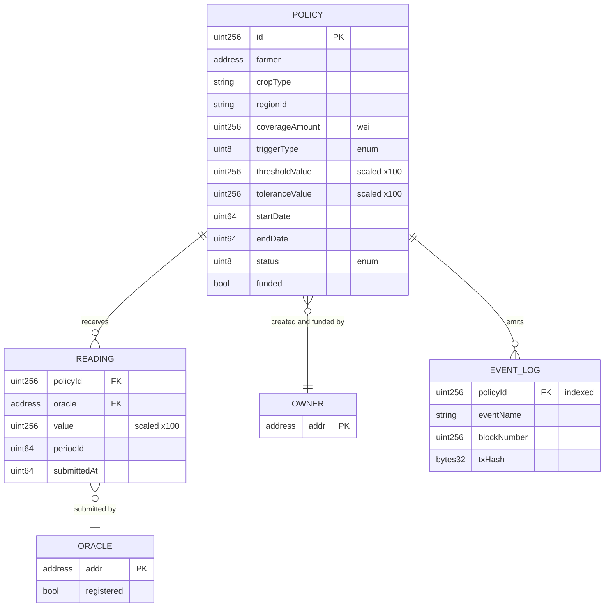
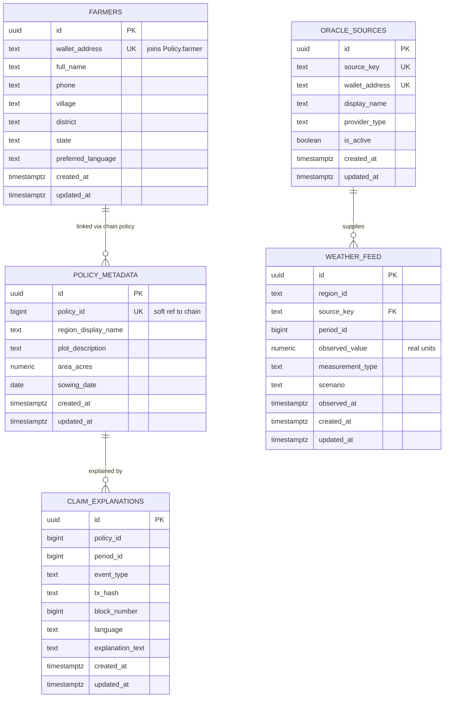
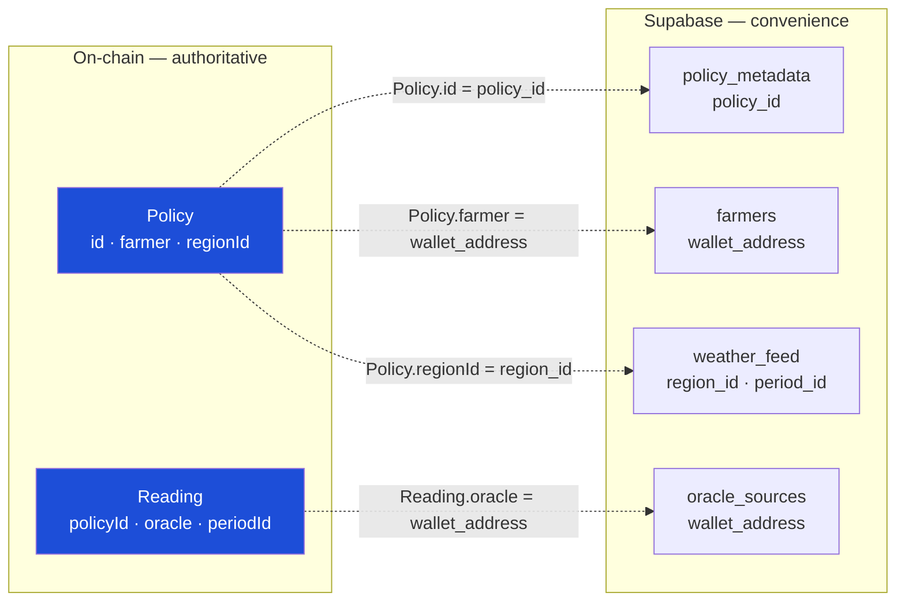

# Database Schema Documentation — KisanShield

**Parametric Crop Insurance with Automatic Payout (PS3)**

| | |
|---|---|
| Document | Schema |
| Version | 1.0 |
| Status | Approved — Phase 0 |
| Last updated | 2026-09-09 |
| Authority | **Canonical source for all entity and field names.** [TRD.md](./TRD.md) and [ImplementationPlan.md](./ImplementationPlan.md) follow this document |

---

## The authority rule

The system stores data in two places with sharply unequal standing.

> **On-chain state is authoritative for anything involving money or a decision. Supabase is convenience only.**

The operational test: **dropping the entire Supabase database must not change any payout outcome and must not lose any decision record.** What is lost is presentational — friendly region names, farmer contact details, cached explanation text — and the simulation's input dataset. The claim ledger itself is fully reconstructible from chain events alone.

This is not defensive engineering. It is the property that makes the product's central claim true: if the off-chain database could alter a payout, then an administrator with database access could alter a payout, and the system would be a conventional database wearing a blockchain costume.

Every off-chain table below is therefore one of exactly two things — **simulation input** or **presentational metadata**. No table records what happened.

## Entity List

### On-chain — authoritative

| Entity | Kind | Purpose |
|---|---|---|
| `Policy` | struct, stored | Insurance contract terms and current status |
| `Reading` | struct, stored | A single weather observation from one oracle |
| `TriggerType` | enum | Which measurement drives the trigger |
| `PolicyStatus` | enum | Lifecycle state |
| `registeredOracles` | mapping | Which addresses may submit readings |
| `owner` | address | The insurer |
| Events | logs | The immutable decision history |

### Off-chain — Supabase, non-authoritative

| Entity | Kind | Purpose |
|---|---|---|
| `farmers` | table | PII deliberately kept off-chain |
| `policy_metadata` | table | Presentational policy detail |
| `weather_feed` | table | Mock dataset driving the oracle simulation |
| `oracle_sources` | table | Display names for oracle addresses |
| `claim_explanations` | table | Cache of rendered explanation text |

## On-Chain Data Model

### Enumerations

```solidity
enum TriggerType  { RainfallBelow, VegetationIndexBelow }   // 0, 1
enum PolicyStatus { Active, PaidOut, Expired, Cancelled }   // 0, 1, 2, 3
```

Both trigger types are "below" comparisons — the insured event is a deficit (drought, poor vegetation). An "above" variant for excess rainfall is a natural extension, deliberately out of scope.

### Measurement units

All measurement values are `uint256` scaled by **100**.

| Real value | Stored |
|---|---|
| 20.00 mm rainfall | `2000` |
| 12.15 mm rainfall | `1215` |
| NDVI 0.35 | `35` |

Solidity has no floating point. A single fixed scale applied uniformly to `thresholdValue`, `toleranceValue`, and `Reading.value` means every comparison is integer arithmetic with no conversion at the comparison site — the class of bug where one side is scaled and the other is not simply cannot arise. The frontend divides by 100 for display; a scaled integer never reaches a farmer's screen ([Design.md](./Design.md)).

Money is `uint256` wei, unscaled — standard Ethereum convention, formatted for display by `ethers.formatEther`.

### `Policy`

| Field | Type | Constraints | Notes |
|---|---|---|---|
| `id` | `uint256` | **PK**, sequential from 1 | Assigned by contract; ID 0 is never valid, so a zero-value read is unambiguously "not found" |
| `farmer` | `address` | ≠ `address(0)` | Payout destination. Read from storage at transfer time, never from a parameter (SEC3) |
| `cropType` | `string` | non-empty | e.g. `"Cotton"` |
| `regionId` | `string` | non-empty | e.g. `"MH-VID-04"`. Opaque identifier; friendly name lives off-chain |
| `coverageAmount` | `uint256` | > 0 | Wei. Exact payout amount |
| `triggerType` | `TriggerType` | valid enum | |
| `thresholdValue` | `uint256` | > 0 | Scaled ×100. Payout when consensus is **strictly below** |
| `toleranceValue` | `uint256` | > 0 | Scaled ×100. Max permitted spread between agreeing oracles |
| `startDate` | `uint64` | < `endDate` | Unix seconds |
| `endDate` | `uint64` | > `startDate` | Unix seconds |
| `status` | `PolicyStatus` | | Set to `PaidOut` **before** transfer (checks-effects-interactions) |
| `funded` | `bool` | | True once escrow ≥ `coverageAmount` |

Stored as `mapping(uint256 => Policy) private policies` with `uint256 public policyCount`.

**No farmer name, phone, or Aadhaar is stored on-chain** (SEC9). On-chain data is permanently public and irremovable; PII placed there could never be corrected or erased. The chain holds an address and an opaque region code, nothing identifying.

### `Reading`

| Field | Type | Constraints | Notes |
|---|---|---|---|
| `policyId` | `uint256` | **FK** → `Policy.id`, must exist | |
| `oracle` | `address` | must be registered at submission | Submitter |
| `value` | `uint256` | | Scaled ×100 |
| `periodId` | `uint64` | | Observation window identifier |
| `submittedAt` | `uint64` | | `block.timestamp` |

Stored as `mapping(uint256 => mapping(uint64 => Reading[])) private readings` — policy → period → readings, giving direct O(1) access to the exact set consensus needs, with no scan.

Duplicate control: `mapping(uint256 => mapping(uint64 => mapping(address => bool))) private hasSubmitted`. One oracle, one reading, per policy-period. Without this a single feed could submit twice and manufacture agreement with itself, defeating the entire consensus mechanism (edge case E3 in [UserFlows.md](./UserFlows.md)).

**`periodId` semantics.** An integer identifying the observation window — for the demo, days since epoch of the window start. Both oracles must use the same `periodId` for the same window; agreement across mismatched windows is meaningless. The oracle harness derives it from the `weather_feed` row so both feeds compute it identically.

### Access-control state

| Field | Type | Purpose |
|---|---|---|
| `owner` | `address` | Insurer. From OpenZeppelin `Ownable`, set at deployment |
| `registeredOracles` | `mapping(address => bool)` | Permitted submitters |
| `oracleList` | `address[]` | Enumeration for the admin console — mappings are not iterable |
| `oracleCount` | `uint256` | Registered feed count |

The existing `MessageBoard.sol` has no access control at all — no owner, no roles, no modifiers. Every field here is new construction.

### Events — the real ledger

Events, not storage, carry history. They cost far less gas than storage, are permanently queryable by indexed topic, and cannot be mutated. The farmer's entire claim ledger is reconstructed from this stream.

| Event | Indexed | Payload |
|---|---|---|
| `PolicyCreated` | `policyId`, `farmer` | `cropType`, `regionId`, `coverageAmount`, `thresholdValue` |
| `PolicyFunded` | `policyId` | `amount` |
| `OracleRegistered` | `oracle` | — |
| `OracleDeregistered` | `oracle` | — |
| `ReadingSubmitted` | `policyId`, `oracle` | `value`, `periodId`, `submittedAt` |
| `ConsensusReached` | `policyId` | `periodId`, `consensusValue`, `spread` |
| `ConsensusFailed` | `policyId` | `periodId`, `spread`, `tolerance` |
| `PayoutTriggered` | `policyId`, `farmer` | `amount`, `consensusValue`, `thresholdValue` |
| `PayoutRejected` | `policyId` | `periodId`, `reasonCode`, `consensusValue`, `thresholdValue` |
| `PolicyCancelled` | `policyId` | — |

`policyId` is indexed on every policy-scoped event, so the ledger is a filtered log query rather than a full scan (TRD, PERF4).

**Every terminating branch of evaluation emits an event.** This is what allows the ledger to explain any outcome instead of leaving a farmer to infer meaning from an absence.

#### `PayoutRejected.reasonCode`

| Code | Condition | Farmer-facing rendering |
|---|---|---|
| 1 | Threshold not breached | "Rainfall was 34mm — above your 20mm threshold, so no payout was due." |
| 2 | Fewer than 2 readings | "Only one of two weather sources has reported so far." |
| 3 | Consensus failed | "The two weather sources disagreed. No payout was made on disputed data." |
| 4 | Policy not `Active` | "This policy has already paid out." |
| 5 | Period outside cover | "This reading is from outside your cover period." |
| 6 | Not funded | "This policy is not yet funded." |

### On-chain relationships



## Off-Chain Data Model — Supabase

Postgres, reached only from the Express backend using the service key. The browser holds no Supabase credential and never queries it directly (SEC8).

**No Supabase resource exists today** — no dependency, no project, no tables. All of this is new construction.

### Common conventions

Every table carries:

| Field | Type | Notes |
|---|---|---|
| `id` | `uuid` | **PK**, `default gen_random_uuid()` |
| `created_at` | `timestamptz` | `default now()`, not null |
| `updated_at` | `timestamptz` | `default now()`, maintained by trigger |

Row-level security is enabled on every table with **no anonymous policy** — access is exclusively server-side via the service role.

`policy_id` columns are `bigint` referencing the on-chain `Policy.id`. They are **not** foreign keys — Postgres cannot reference chain state. Every such column is a soft reference the backend must tolerate being absent, which is precisely what makes the authority rule enforceable.

### `farmers`

PII, deliberately off-chain.

| Column | Type | Constraints |
|---|---|---|
| `id` | `uuid` | PK |
| `wallet_address` | `text` | unique, not null, `~ '^0x[a-fA-F0-9]{40}$'` |
| `full_name` | `text` | not null, length 1–120 |
| `phone` | `text` | `~ '^[0-9]{10}$'` |
| `village` | `text` | |
| `district` | `text` | |
| `state` | `text` | |
| `preferred_language` | `text` | default `'en'`, in (`'en'`,`'hi'`,`'mr'`) |
| `created_at` / `updated_at` | `timestamptz` | |

Index: `idx_farmers_wallet` unique on `wallet_address` — the join key from on-chain `Policy.farmer`.

### `policy_metadata`

Presentational detail with no bearing on any decision.

| Column | Type | Constraints |
|---|---|---|
| `id` | `uuid` | PK |
| `policy_id` | `bigint` | unique, not null — soft ref to chain |
| `region_display_name` | `text` | e.g. `"Vidarbha, Maharashtra"` |
| `plot_description` | `text` | |
| `area_acres` | `numeric(6,2)` | `> 0` |
| `sowing_date` | `date` | |
| `notes` | `text` | |
| `created_at` / `updated_at` | `timestamptz` | |

Index: `idx_policy_metadata_policy_id` unique on `policy_id`.

Absence degrades display only — `regionId` renders as `MH-VID-04` instead of "Vidarbha, Maharashtra" (UserFlows F4).

### `weather_feed`

The mock dataset the oracle harness reads. **Simulation input, never a payout record.** Chain readings are authoritative for what was actually submitted.

| Column | Type | Constraints |
|---|---|---|
| `id` | `uuid` | PK |
| `region_id` | `text` | not null — matches on-chain `Policy.regionId` |
| `source_key` | `text` | not null, in (`'feed_a'`,`'feed_b'`) |
| `period_id` | `bigint` | not null — matches on-chain `Reading.periodId` |
| `observed_value` | `numeric(10,2)` | not null, `>= 0` — **real units**, mm |
| `measurement_type` | `text` | not null, in (`'rainfall'`,`'ndvi'`) |
| `observed_at` | `timestamptz` | not null |
| `scenario` | `text` | default `'baseline'`, in (`'baseline'`,`'drought'`,`'disagreement'`) |
| `created_at` / `updated_at` | `timestamptz` | |

Constraints: unique `(region_id, source_key, period_id, scenario)`; index `idx_weather_region_period` on `(region_id, period_id)`.

Note `observed_value` is stored in **real units** here and scaled ×100 by the harness at submission. Off-chain data stays human-readable and directly inspectable; scaling is an on-chain concern applied at exactly one boundary.

The `scenario` column drives the three demo paths — `baseline` (above threshold, no payout), `drought` (below threshold, payout), `disagreement` (feeds diverge beyond tolerance). Making scenarios data rather than code means the demo's three outcomes are switched by a query parameter instead of an edit.

### `oracle_sources`

Display names for oracle addresses. Chain registration is authoritative for *permission*.

| Column | Type | Constraints |
|---|---|---|
| `id` | `uuid` | PK |
| `source_key` | `text` | unique, not null — joins `weather_feed.source_key` |
| `wallet_address` | `text` | unique, not null, address format |
| `display_name` | `text` | not null, e.g. `"District Weather Station Network"` |
| `provider_type` | `text` | in (`'weather_station'`,`'satellite'`,`'simulated'`) |
| `is_active` | `boolean` | default true |
| `created_at` / `updated_at` | `timestamptz` | |

`is_active` is presentational. A feed deregistered on-chain cannot submit regardless of what this column says — the UI must read chain state, not this flag, when showing whether a feed can submit.

### `claim_explanations`

Cache of rendered explanation text. Fully regenerable from events; safe to truncate at any time.

| Column | Type | Constraints |
|---|---|---|
| `id` | `uuid` | PK |
| `policy_id` | `bigint` | not null |
| `period_id` | `bigint` | |
| `event_type` | `text` | not null |
| `tx_hash` | `text` | `~ '^0x[a-fA-F0-9]{64}$'` |
| `block_number` | `bigint` | |
| `language` | `text` | default `'en'` |
| `explanation_text` | `text` | not null |
| `created_at` / `updated_at` | `timestamptz` | |

Constraints: unique `(policy_id, tx_hash, language)`; index `idx_claim_expl_policy` on `(policy_id, created_at desc)`.

`tx_hash` makes the cache self-invalidating — a rendering is bound to the exact transaction it describes, so it can never drift from the event it explains.

### Off-chain ER diagram



## Cross-Boundary Relationships

The two stores are joined by value, never by referential integrity.



Dotted lines are soft joins. Every one must be treated as optionally absent by the backend: a missing `policy_metadata` row degrades a display name, a missing `farmers` row degrades a contact detail. Neither can affect a payout, a status, or a ledger entry.

| Join | Direction | On absence |
|---|---|---|
| `Policy.id` → `policy_metadata.policy_id` | chain → DB | Show raw `regionId` |
| `Policy.farmer` → `farmers.wallet_address` | chain → DB | Show truncated address |
| `Policy.regionId` → `weather_feed.region_id` | chain → DB | Harness cannot simulate; existing readings unaffected |
| `Reading.oracle` → `oracle_sources.wallet_address` | chain → DB | Show truncated address |

## Data Validation Rules

### On-chain — enforced by revert

| Rule | Failure |
|---|---|
| `farmer != address(0)` | `InvalidFarmer()` |
| `coverageAmount > 0` | `InvalidCoverage()` |
| `thresholdValue > 0` | `InvalidThreshold()` |
| `toleranceValue > 0` | `InvalidTolerance()` |
| `endDate > startDate` | `InvalidPeriod()` |
| `bytes(cropType).length > 0` | `EmptyCropType()` |
| `bytes(regionId).length > 0` | `EmptyRegionId()` |
| `msg.value >= coverageAmount` on fund | `InsufficientFunding()` |
| Caller is `owner` for admin functions | `OwnableUnauthorizedAccount()` |
| Caller is registered for `submitReading` | `NotRegisteredOracle()` |
| Oracle has not already submitted for this policy-period | `DuplicateReading()` |
| Policy exists | `NoSuchPolicy(uint256)` |
| Policy not already `PaidOut` on cancel | `PolicyAlreadySettled()` |

Custom errors rather than `require` strings — the existing `MessageBoard.sol` already establishes this pattern, and it is both cheaper and more precisely testable.

Validation failures inside `evaluatePolicy` are **not** reverts. They emit `PayoutRejected` with a reason code and return normally. This is deliberate: a revert leaves no record, and the farmer's right to an explanation of a non-payout is a core requirement (PRD FR22). Only genuinely invalid *calls* revert; valid calls with negative *outcomes* are recorded.

### Off-chain — enforced by Postgres

| Table | Constraints |
|---|---|
| `farmers` | Address format regex; phone 10 digits; name 1–120 chars; language enum |
| `policy_metadata` | `area_acres > 0`; unique `policy_id` |
| `weather_feed` | `observed_value >= 0`; measurement and scenario enums; unique `(region_id, source_key, period_id, scenario)` |
| `oracle_sources` | Address format; unique `source_key` and `wallet_address`; provider enum |
| `claim_explanations` | `tx_hash` 32-byte hex; non-empty text; unique `(policy_id, tx_hash, language)` |

## Audit Fields

**On-chain:** no explicit audit columns are needed, because the chain *is* the audit log. Every event carries block number, block timestamp, transaction hash, and sender. `Reading.submittedAt` and the `PolicyStatus` transitions are permanently attributable, and no participant — including the contract owner — can alter or remove a past record. This is a stronger guarantee than any `updated_by` column can offer, and it is the reason no separate audit trail is built (TRD, Monitoring).

**Off-chain:** `created_at` and `updated_at` on every table, with `updated_at` maintained by a shared trigger:

```sql
create or replace function set_updated_at() returns trigger as $$
begin
  new.updated_at = now();
  return new;
end;
$$ language plpgsql;
```

No `deleted_at`. Off-chain rows are regenerable or re-seedable; soft deletion would add complexity to data that carries no evidentiary weight.

## Indexes Summary

| Table | Index | Type | Rationale |
|---|---|---|---|
| `farmers` | `wallet_address` | unique btree | Join key from `Policy.farmer` |
| `policy_metadata` | `policy_id` | unique btree | Primary lookup on every policy view |
| `weather_feed` | `(region_id, period_id)` | btree | Harness query for a window |
| `weather_feed` | `(region_id, source_key, period_id, scenario)` | unique btree | Duplicate prevention |
| `oracle_sources` | `source_key`, `wallet_address` | unique btree | Both join directions |
| `claim_explanations` | `(policy_id, created_at desc)` | btree | Ledger fetch, newest first |
| `claim_explanations` | `(policy_id, tx_hash, language)` | unique btree | Cache key |

On-chain, `policyId` is indexed on every policy-scoped event, making ledger construction a filtered topic query rather than a scan.

---

## Related documents

- [PRD](./PRD.md) — requirements
- [TRD](./TRD.md) — architecture and contract specification
- [User Flows](./UserFlows.md) — decision trees and edge cases
- [Design](./Design.md) — display formatting rules
- [Implementation Plan](./ImplementationPlan.md) — phased tasks
- [Tracker](../TRACKER.md) — project state
