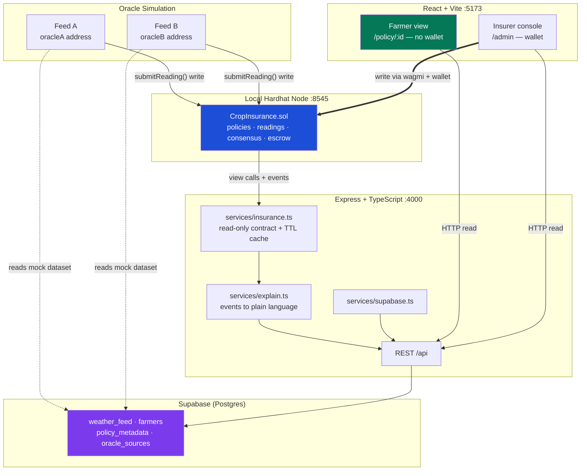

# Technical Requirements Document — KisanShield

**Parametric Crop Insurance with Automatic Payout (PS3)**

| | |
|---|---|
| Document | TRD |
| Version | 1.0 |
| Status | Approved — Phase 0 |
| Last updated | 2026-09-09 |
| Implements | [PRD.md](./PRD.md) |

---

## System Overview

KisanShield is a parametric crop insurance system in which a smart contract, rather than a human loss assessor, decides whether a payout is due. Independent oracle feeds submit weather readings on-chain; the contract requires those readings to agree within a tolerance, compares the agreed value to a pre-committed threshold, and transfers escrowed funds to the farmer when the condition is met. Every reading and every decision emits an event, and a public web view renders that event history as plain-language explanation.

Three actors interact with the system:

| Actor | Interface | Identity |
|---|---|---|
| Insurer / admin | React console | Wallet (must equal contract `owner`) |
| Oracle operator | Node script / backend endpoint | Wallet (must be a registered oracle) |
| Farmer | Public web page | **None** — no wallet, no login |

The central design constraint is that **the farmer's path is read-only and unauthenticated**. This is what makes the wallet-free requirement achievable: the farmer never originates a transaction, so they never need a key.

### Why blockchain — the load-bearing argument

A conventional database with an admin account can be edited after the fact, and the farmer cannot detect it. This system's guarantee is narrower and stronger than "we store data honestly":

1. **The payout rule is committed before the data arrives.** Threshold and period are fixed at policy creation and are immutable.
2. **The data comes from independently registered sources and must agree.** No single party — including the insurer — can move a payout by submitting a convenient reading.
3. **The decision is executed by the contract, not requested from it.** There is no "approve claim" function for anyone to withhold.
4. **The record is append-only and publicly verifiable.** A rejected claim cannot be quietly deleted.

Remove any one of these and a database would suffice. The multi-oracle consensus requirement (point 2) is therefore treated as a core feature, not a nice-to-have.

## Architecture Overview



### Data path rule

The scaffold already establishes a split data path, and it is retained deliberately:

- **Reads flow through the backend.** The frontend never needs an RPC connection to display a policy. This is precisely what allows the farmer view to work with no wallet and no web3 provider.
- **Writes go directly from browser to chain via wagmi.** The backend never holds a private key for user actions, so it can never sign on a user's behalf.
- **Oracle writes are the one server-side signing path**, isolated to the simulation harness and using dedicated oracle keys that are never the insurer's key.

### Authority rule

**On-chain state is authoritative for anything involving money or a decision. Supabase is convenience only.**

Concretely: dropping the entire Supabase database must not change any payout outcome, and must not lose any decision record. It costs the farmer view its human-readable region names and the oracle harness its mock dataset — the ledger itself is reconstructible from chain events alone. Every off-chain table is therefore either input to the simulation or presentational metadata, never a source of truth about what happened.

## Technology Choices

| Layer | Technology | Status | Rationale |
|---|---|---|---|
| Contracts | Solidity 0.8.24 | **In place** | Built-in overflow checks and custom errors; scaffold already targets it |
| Contract tooling | Hardhat + `@nomicfoundation/hardhat-toolbox` 5, ethers v6 | **In place** | Working compile/test/deploy pipeline with 8 passing tests |
| Access control | OpenZeppelin `Ownable` | **New dependency** | Audited, minimal; hand-rolling ownership is needless risk given C2 (no blockchain expertise) |
| Backend | Node + Express 4 (ESM) + TypeScript strict | **In place** | Running server with routing, error middleware, health check |
| Chain reads | ethers v6 `JsonRpcProvider`, read-only `Contract` | **In place** | `backend/src/services/chain.ts` structure is reused with domain types swapped |
| Off-chain DB | Supabase (Postgres) via `@supabase/supabase-js` | **New dependency** | Managed Postgres, no schema-migration tooling to build inside the budget |
| Frontend | React 18 + Vite 5 + TypeScript | **In place** | Fast dev loop; production build already verified |
| Wallet | wagmi v2 + RainbowKit + viem | **In place** | Configured with `hardhat` and `sepolia` chains |
| Routing | `react-router-dom` | **New dependency** | Scaffold has a single `App.tsx` with no router; distinct farmer and admin routes are required |
| Testing | Hardhat + Chai matchers | **In place** | Pattern established by the existing test suite |

### What exists versus what is new

Stated plainly, because the planning must not assume more than the repository contains:

**Reused as-is (infrastructure):**
- npm workspaces monorepo; dependencies installed at every level
- Hardhat config: solidity 0.8.24, optimizer 200 runs, `localhost` network
- `contracts/scripts/deploy.js` artifact-generation pattern — writes `{address, chainId, network, deployedAt, abi}` to both `backend/src/deployment.json` and `frontend/src/lib/deployment.json`. Only the contract name changes.
- `backend/src/config.ts` lazy deployment loading, returning `null` when absent
- `backend/src/services/chain.ts` **structure**: single provider, read-only contract instance, TTL cache. Domain types are replaced.
- Express routing, 404 and error middleware, `GET /api/health`
- wagmi/RainbowKit provider nesting in `frontend/src/main.tsx`
- Vite `/api` proxy to `localhost:4000`

**Written fresh (domain):**
- `CropInsurance.sol` in full. The existing `MessageBoard.sol` has no access control, no roles, no escrow, and no oracle interface — there is nothing to adapt, only infrastructure to inherit. It is deleted, not refactored.
- All contract tests
- Oracle simulation harness
- Supabase client, schema, and seed data — no database of any kind exists today
- React Router setup, farmer views, insurer console. `PostComposer.tsx` and `PostList.tsx` are deleted.
- Plain-language explanation service

## Contract Specification

The canonical on-chain vocabulary. [Schema.md](./Schema.md) holds the authoritative field-level definitions; every other document uses exactly these names.

### Enumerations

```solidity
enum TriggerType   { RainfallBelow, VegetationIndexBelow }
enum PolicyStatus  { Active, PaidOut, Expired, Cancelled }
```

`RainfallBelow` is the demo trigger. `VegetationIndexBelow` is declared so the evaluation branch is structurally present, and is first on the cut list.

### Structs

```solidity
struct Policy {
    uint256      id;
    address      farmer;
    string       cropType;
    string       regionId;
    uint256      coverageAmount;    // wei, escrowed
    TriggerType  triggerType;
    uint256      thresholdValue;    // scaled integer — see units
    uint256      toleranceValue;    // max spread between agreeing oracles
    uint64       startDate;
    uint64       endDate;
    PolicyStatus status;
    bool         funded;
}

struct Reading {
    uint256 policyId;
    address oracle;
    uint256 value;                  // same scale as thresholdValue
    uint64  periodId;               // observation window identifier
    uint64  submittedAt;            // block timestamp
}
```

**Units.** All measurement values are unsigned integers scaled by 100 — rainfall in hundredths of a millimetre (20.00mm → `2000`), vegetation index in hundredths (0.35 → `35`). Solidity has no floating point; a single fixed scale applied uniformly to `thresholdValue`, `toleranceValue`, and `Reading.value` avoids per-field conversion errors. The frontend divides by 100 for display and never shows a farmer a scaled integer.

### Functions

| Function | Access | Purpose |
|---|---|---|
| `createPolicy(...) returns (uint256)` | `onlyOwner` | Records policy terms, assigns sequential ID, emits `PolicyCreated` |
| `fundPolicy(uint256 policyId) payable` | `onlyOwner` | Escrows `msg.value ≥ coverageAmount`, sets `funded`, emits `PolicyFunded` |
| `registerOracle(address)` | `onlyOwner` | Adds a permitted submitter, emits `OracleRegistered` |
| `deregisterOracle(address)` | `onlyOwner` | Removes a submitter, emits `OracleDeregistered` |
| `submitReading(uint256 policyId, uint256 value, uint64 periodId)` | `onlyRegisteredOracle` | Records a reading, emits `ReadingSubmitted`. Reverts if this oracle already submitted for this policy and period |
| `evaluatePolicy(uint256 policyId, uint64 periodId)` | **public** | Runs consensus and trigger evaluation; pays out when satisfied |
| `cancelPolicy(uint256 policyId)` | `onlyOwner` | Sets `Cancelled`, refunds escrow to owner, emits `PolicyCancelled` |
| `getPolicy(uint256) view` | public | Returns the `Policy` struct |
| `getReadings(uint256 policyId, uint64 periodId) view` | public | Returns readings for a period |
| `getPolicyCount() view` | public | Total policies issued |
| `isRegisteredOracle(address) view` | public | Oracle registration check |

`evaluatePolicy` is deliberately **permissionless** (FR17). If only the insurer could call it, the insurer could suppress a payout by never calling — reintroducing exactly the discretionary gate the system exists to remove. Anyone may call it; the outcome depends solely on on-chain state, so a hostile caller can achieve nothing beyond spending their own gas.

### Events

| Event | Emitted when |
|---|---|
| `PolicyCreated(uint256 indexed policyId, address indexed farmer, string cropType, string regionId, uint256 coverageAmount, uint256 thresholdValue)` | Policy is created |
| `PolicyFunded(uint256 indexed policyId, uint256 amount)` | Escrow is deposited |
| `OracleRegistered(address indexed oracle)` | Oracle is permitted |
| `OracleDeregistered(address indexed oracle)` | Oracle is revoked |
| `ReadingSubmitted(uint256 indexed policyId, address indexed oracle, uint256 value, uint64 periodId, uint64 submittedAt)` | A reading is recorded |
| `ConsensusReached(uint256 indexed policyId, uint64 periodId, uint256 consensusValue, uint256 spread)` | Readings agree within tolerance |
| `ConsensusFailed(uint256 indexed policyId, uint64 periodId, uint256 spread, uint256 tolerance)` | Readings disagree beyond tolerance |
| `PayoutTriggered(uint256 indexed policyId, address indexed farmer, uint256 amount, uint256 consensusValue, uint256 thresholdValue)` | Funds are transferred |
| `PayoutRejected(uint256 indexed policyId, uint64 periodId, uint8 reasonCode, uint256 consensusValue, uint256 thresholdValue)` | Evaluation completes without payout |
| `PolicyCancelled(uint256 indexed policyId)` | Policy is cancelled |

`PayoutRejected.reasonCode` is the backbone of the plain-language negative case (FR22):

| Code | Meaning | Farmer-facing rendering |
|---|---|---|
| 1 | Threshold not breached | "Rainfall was 34mm — above your 20mm threshold, so no payout was due." |
| 2 | Insufficient readings | "Only one of two weather sources has reported so far. We need both before deciding." |
| 3 | Consensus failed | "The two weather sources disagreed. No payout was made on disputed data." |
| 4 | Policy not active | "This policy has already paid out." |
| 5 | Outside policy period | "This reading is from outside your cover period." |
| 6 | Policy not funded | "This policy is not yet funded." |

### Consensus algorithm

```
readings ← all readings for (policyId, periodId)
if count(readings) < 2                    → PayoutRejected(2); stop
spread ← max(values) − min(values)
if spread > policy.toleranceValue         → ConsensusFailed; PayoutRejected(3); stop
consensusValue ← mean(values)
emit ConsensusReached(consensusValue, spread)

if policy.status ≠ Active                 → PayoutRejected(4); stop
if periodId·1days outside [startDate, endDate]  → PayoutRejected(5); stop   // periodId is days-since-epoch; dates are Unix seconds — D19
if not policy.funded                      → PayoutRejected(6); stop

triggered ← consensusValue < policy.thresholdValue     // both trigger types are "below"
if not triggered                          → PayoutRejected(1); stop

policy.status ← PaidOut                                 // set BEFORE transfer
transfer(policy.farmer, policy.coverageAmount)
emit PayoutTriggered
```

Two properties are load-bearing. **Status is set before the transfer** — checks-effects-interactions, closing the reentrancy path on a policy whose farmer address is a contract. And **every terminating branch emits an event**, so the farmer ledger can explain any outcome without inferring from silence.

## Backend Requirements

### Structure

```
backend/src/
  index.ts                    modify — mount insurance routes, drop posts
  config.ts                   reuse  — lazy deployment.json loading
  deployment.json             generated by deploy script
  services/
    insurance.ts              new    — replaces chain.ts; read-only contract + TTL cache
    explain.ts                new    — events to plain-language claim ledger
    supabase.ts               new    — Supabase client
  routes/
    policies.ts               new    — replaces posts.ts
    oracle.ts                 new    — simulation trigger endpoints
```

`backend/src/services/chain.ts` is renamed and rewritten as `insurance.ts`, keeping its proven shape: one `JsonRpcProvider`, one read-only `Contract`, a short TTL cache, and a `toPolicy()` converter mapping raw contract output to a JSON-safe shape with `bigint` serialised and wei formatted. The existing 5-second cache TTL is retained — it protects against view-call storms during demo polling while staying well under the human-perceptible staleness threshold.

### API surface

All routes under `/api`, extending the existing router mounting pattern.

| Method | Path | Auth | Purpose |
|---|---|---|---|
| GET | `/api/health` | none | **Existing.** Extended with oracle registration status |
| GET | `/api/policies` | none | List policies, paginated (`offset`, `limit`, max 100 — mirrors existing convention) |
| GET | `/api/policies/:id` | none | Policy terms, status, current readings, threshold comparison |
| GET | `/api/policies/:id/ledger` | none | **The centrepiece.** Chronological plain-language decision history from events |
| GET | `/api/policies/:id/verify` | none | Raw on-chain proof: contract address, block numbers, transaction hashes, event payloads |
| GET | `/api/oracles` | none | Registered oracle addresses and last submission time |
| POST | `/api/oracles/simulate` | dev-only | Drives the demo: submits a reading from one or both simulated feeds (built P5 as a sub-path of the oracles router, alongside `GET /api/oracles`, rather than a singular sibling) |

`GET /api/policies/:id` and `/ledger` must succeed with Supabase unreachable, degrading to on-chain data with region identifiers shown raw instead of as friendly names (NFR10). Supabase failure is logged and swallowed, never propagated to a farmer-facing response.

### Explanation service

`services/explain.ts` converts an event stream into farmer-readable narrative. It is the single place where technical vocabulary is translated, so plain-language review has exactly one target file (NFR5, R8).

Rules it enforces:
- Values are rendered in human units — `2000` → "20mm", wei → "₹25,000"
- Every explanation cites the actual numbers behind the decision
- No unglossed term: no "wei", no "gas", no bare transaction hash
- Rejections are phrased as explanations, never as errors

## Frontend Requirements

### Routing — new work

The scaffold has no router. React Router is added with three routes:

| Route | Access | Purpose |
|---|---|---|
| `/` | public | Landing: policy ID lookup, link to admin |
| `/policy/:id` | **public, no wallet** | Farmer view — terms, readings vs. threshold, ledger, verification |
| `/admin` | wallet, owner only | Insurer console — create, fund, register oracles, monitor |

### Component changes

| Component | Disposition |
|---|---|
| `main.tsx` provider nesting | **Reuse**, add `BrowserRouter` |
| `lib/wagmi.ts` | **Reuse** unchanged |
| `lib/contract.ts` | **Modify** — same deployment.json import, new ABI |
| `lib/api.ts` | **Modify** — same fetch pattern, new domain types |
| `components/PostComposer.tsx` | **Delete** |
| `components/PostList.tsx` | **Delete** |
| `App.tsx` | **Rewrite** as router shell |
| Farmer views, admin console | **New** |

The farmer view must not import wagmi. Enforcing this at the module level is what guarantees the wallet-free requirement structurally rather than by convention — a wallet prompt cannot appear on a page that never loads a wallet library.

## Database Requirements

Supabase Postgres, accessed only from the Express backend using the service key. The browser never holds a Supabase credential and never queries Supabase directly.

Tables — full definitions in [Schema.md](./Schema.md):

| Table | Purpose | Authoritative? |
|---|---|---|
| `farmers` | Name, phone, village — never on-chain (privacy, cost) | No |
| `policy_metadata` | Plot description, friendly region name, sowing date | No |
| `weather_feed` | Mock dataset the oracle harness reads | No — simulation input |
| `oracle_sources` | Feed registry: address, display name, provider | No — chain is authoritative |
| `claim_explanations` | Cached rendered explanations | No — regenerable from events |

Every table carries `created_at` and `updated_at`. Row-level security is enabled with no anonymous policy, since access is exclusively server-side.

## Security Requirements

| ID | Requirement | Mechanism |
|---|---|---|
| SEC1 | Only the insurer can create, fund, or cancel policies | `Ownable.onlyOwner` |
| SEC2 | Only registered oracles can submit readings | `onlyRegisteredOracle` modifier |
| SEC3 | Funds leave the contract only to the policy's recorded farmer address | Transfer target read from storage, never from a parameter |
| SEC4 | A policy cannot pay out twice | Status set to `PaidOut` before transfer; guard on entry |
| SEC5 | No reentrancy on payout | Checks-effects-interactions ordering |
| SEC6 | Authorisation is enforced on-chain, not in the UI | Frontend gating is presentation only; contract reverts regardless |
| SEC7 | No private key is held server-side for user actions | Users sign in-browser via wagmi. Only the oracle harness signs server-side, with dedicated keys |
| SEC8 | Supabase credentials never reach the browser | Service key stays in backend environment; no `VITE_`-prefixed Supabase variable exists |
| SEC9 | Farmer PII stays off-chain | On-chain policies hold an address and a region string, never a name or phone number |
| SEC10 | No secrets in the repository | `.env.example` files only; `.env` gitignored |
| SEC11 | Oracle keys are distinct from the owner key | Separate Hardhat accounts, so a compromised feed cannot administer the contract |

### Known limitations, stated openly

- Oracle registration is centralised — the insurer chooses the feeds. Consensus prevents a single *feed* from moving a payout; it does not prevent an insurer who registers two colluding feeds. Production would require independently governed operators with stake at risk.
- Two-of-two consensus means either feed can block a payout by disagreeing. Three-of-three with a median is the natural hardening (NH2).
- No reading is cryptographically signed at source; a registered address is trusted for what it submits.
- No contract audit, no formal verification.

## Scalability Requirements

Hackathon scale is trivially small — tens of policies. The design decisions that matter are the ones that would not need reversing at real scale:

- **Events, not storage, for history.** Reading history and decisions are reconstructed from logs, which are far cheaper than storage growth. The pattern is unchanged at 10 or 10 million policies.
- **Paginated list endpoints from the start**, following the scaffold's existing `offset`/`limit`/`MAX_LIMIT` convention. No endpoint returns an unbounded collection.
- **Per-policy escrow** rather than a shared pool. Simpler to reason about and to demonstrate solvency; a pooled reserve with tranching is the production evolution.
- **Bounded loops.** Consensus iterates over readings for one policy-period, capped by the number of registered oracles — never over all policies.

Explicitly deferred: batch evaluation across policies, event indexing (a subgraph or equivalent) instead of direct log queries, and multi-insurer tenancy.

## Performance Requirements

| ID | Target | Approach |
|---|---|---|
| PERF1 | Farmer view interactive in < 2s on mid-range Android over 4G | Backend-rendered JSON, no web3 bundle on the farmer route, Vite code-splitting by route |
| PERF2 | Payout confirmed within 30s of evaluation | Local Hardhat node — sub-second block times |
| PERF3 | `/api/policies/:id` p95 < 300ms | 5s TTL cache in front of view calls, carried over from the scaffold |
| PERF4 | Ledger construction < 500ms | Filtered log queries by indexed `policyId`, not full-range scans |
| PERF5 | Farmer route JS bundle materially smaller than admin | Route-level lazy loading; wagmi and RainbowKit load only on `/admin` |

PERF5 is a correctness property as much as a performance one — it is the mechanism by which the farmer route is guaranteed wallet-free.

## API Strategy

REST over JSON, extending the scaffold's established conventions rather than introducing new ones.

- All routes under `/api`; one Express router per resource, mounted in `index.ts`
- Pagination via `offset` / `limit`, `MAX_LIMIT = 100`, default 20 — matching the existing posts router
- List responses shaped `{ items, total, offset, limit }`
- Errors return `{ error: { code, message } }` with an appropriate status
- `bigint` is never emitted raw; wei is formatted to a decimal string, scaled measurements to human units
- Read endpoints are unauthenticated by design — the ledger's public verifiability is a feature, and on-chain data is public regardless

GraphQL was not chosen: the query surface is small and fixed, and a schema layer would cost setup time the budget does not have.

## Authentication Strategy

| Actor | Method | Rationale |
|---|---|---|
| Farmer | **None** | Policy data is public and verifiable by design. Authentication would add friction against G5 and protect nothing that is not already public |
| Insurer | Wallet signature via RainbowKit/wagmi | Identity is the `owner` address; no password, no session, no user table |
| Oracle | Private key held by the harness | Submissions are authorised by transaction signature |

There is no session, no JWT, and no user table. Every privileged action is authorised by a transaction signature the contract verifies. Server-side session handling is not merely unnecessary — omitting it removes an entire class of vulnerability from the system.

Farmer identity in the demo is possession of a policy ID, delivered by link. In production a policy ID would be paired with a lookup code or delivered via an authenticated channel; this is noted as a production gap, not solved here.

## Authorization Strategy

**Authorisation lives on-chain. The frontend hides what a user cannot do; the contract enforces it.**

Worth stating plainly: the existing `MessageBoard.sol` has *no* access control of any kind — no owner, no roles, no modifiers. Every authorisation mechanism below is new construction.

| Role | Holder | Capabilities |
|---|---|---|
| `owner` | Insurer wallet, set at deployment | Create, fund, cancel policies; register/deregister oracles |
| Registered oracle | Addresses added by owner | `submitReading` only |
| Anyone | Any address | `evaluatePolicy`, all view functions |
| Farmer | No on-chain role | Reads via the public web view; needs no permission |

Two decisions carry the design:

**`evaluatePolicy` is permissionless.** A privileged evaluator could withhold a payout by declining to call — recreating the discretionary gate the system exists to eliminate. Permissionless evaluation means a farmer, an NGO, or a watchdog can force the question, and the answer depends only on chain state.

**The farmer has no role.** Roles imply keys, and keys imply wallets. The farmer's entire interaction is reading public data, which requires no authorisation at all. This is what makes G5 achievable rather than aspirational.

## Deployment Strategy

**Target: local Hardhat node.** Chosen for judging reliability — no network dependency, no faucet, no gas cost, no congestion, and full reproducibility from a cold start (C4).

```bash
npm run chain      # terminal 1 — hardhat node on :8545
npm run deploy     # terminal 2 — deploy + seed demo policy
npm run dev        # terminal 3 — api :4000 + web :5173
```

`contracts/scripts/deploy.js` is reused with the contract name changed. It already writes `{address, chainId, network, deployedAt, abi}` into both `backend/src/deployment.json` and `frontend/src/lib/deployment.json` — this generated-artifact pattern keeps address and ABI in sync across all three workspaces automatically and is worth preserving exactly.

A separate seed script provisions the demo: register two oracle accounts, create a demo policy, fund it. Deterministic Hardhat accounts make this reproducible run to run.

The contract is network-agnostic. Sepolia deployment already exists conditionally in `hardhat.config.js` when `SEPOLIA_RPC_URL` and `PRIVATE_KEY` are set — available if wanted, not on the demo path.

**Rollback:** stop the node, restart, redeploy. Chain state is disposable; there is no migration to reverse. Supabase changes are additive and non-authoritative.

## Monitoring Strategy

Proportionate to a demo, but not absent.

- **`GET /api/health`** — extended from the existing endpoint. Reports contract address, chain ID, whether oracles are registered, and Supabase reachability. Follows the established pattern of returning 200 with a warning field on RPC failure rather than a hard error, so a partially-degraded system is diagnosable rather than opaque.
- **Structured request logging** — method, path, status, duration.
- **Chain-call error logging** — RPC failures logged with the failing call, since a stale or missing `deployment.json` is the most likely demo-day failure and must be immediately identifiable.
- **Oracle liveness** — last submission timestamp per registered oracle, surfaced in the admin console. A silent feed is the failure mode most likely to make the demo appear broken.
- **Contract events as the audit log** — no separate audit trail is built; events already constitute one.

Deferred: APM, error aggregation, uptime monitoring, alerting.

## Testing Strategy

### Contract tests — the priority

Contract tests receive the largest share of testing effort because contract bugs are the only ones that can misdirect money. The existing suite (8 tests, Hardhat + Chai matchers) establishes the pattern; these replace it.

| Area | Cases |
|---|---|
| Policy lifecycle | Create with valid terms; non-owner creation reverts; sequential IDs; funding sets `funded`; underfunding reverts; cancel refunds owner |
| Oracle registration | Owner registers; non-owner reverts; deregistration blocks subsequent submission; `isRegisteredOracle` correctness |
| Reading submission | Registered oracle succeeds and emits; unregistered reverts; duplicate submission for same policy-period reverts; distinct periods accepted |
| Consensus — agreement | Two readings inside tolerance emit `ConsensusReached` with correct mean and spread |
| Consensus — disagreement | Two readings outside tolerance emit `ConsensusFailed` and `PayoutRejected(3)`; **no funds move** |
| Consensus — insufficient | One reading emits `PayoutRejected(2)`; no funds move |
| Trigger — met | Consensus below threshold transfers exactly `coverageAmount` to farmer (`changeEtherBalances`), emits `PayoutTriggered`, sets `PaidOut` |
| Trigger — not met | Consensus above threshold emits `PayoutRejected(1)`; no funds move |
| Double payout | Second evaluation after payout emits `PayoutRejected(4)`; balance unchanged |
| Boundary | Consensus exactly equal to threshold does **not** trigger (strictly-below semantics) |
| Period bounds | Reading outside `[startDate, endDate]` emits `PayoutRejected(5)` |
| Unfunded | Evaluation on an unfunded policy emits `PayoutRejected(6)`; no transfer attempted |
| Permissionless evaluation | A non-owner, non-oracle address can call `evaluatePolicy` and obtain the correct outcome |

The boundary case is called out deliberately: "below the threshold" and "at or below the threshold" differ by one farmer's payout, and the ambiguity must be resolved by a test rather than by reading the implementation.

### Backend tests

Explanation service unit tests — each `PayoutRejected` reason code produces correct, jargon-free text citing real numbers. Route tests for pagination bounds, unknown policy ID (404), and graceful degradation with Supabase unreachable.

### Frontend

Type checking via the existing `npm run typecheck`, plus manual verification against the demo script. Automated component testing is out of budget and is recorded as accepted debt rather than silently omitted.

### End-to-end verification

Manual, following the demo script:

1. Start node, deploy, seed → demo policy exists and is funded
2. Open `/policy/1` in a browser with **no wallet extension** → policy renders fully
3. Submit reading from feed A only → ledger explains that one source has reported and a decision awaits the second
4. Submit an agreeing reading from feed B below threshold → payout fires, farmer balance increases by exactly the coverage amount
5. Farmer view shows the plain-language explanation with real numbers and verifiable on-chain proof
6. Second policy, disagreeing readings → no payout; ledger explains the disagreement
7. Third policy, agreeing readings above threshold → no payout; ledger explains the shortfall

Steps 6 and 7 are not optional polish. A system that only demonstrates the paying case has not shown that the trigger *decides* anything.

### Acceptance gate

Per [AgentRules.md](./AgentRules.md) Rule 14, no task is complete until: the build succeeds, tests pass, functionality is verified by execution rather than inspection, documentation is updated, and [TRACKER.md](../TRACKER.md) reflects the change.

---

## Related documents

- [PRD](./PRD.md) — product requirements
- [User Flows](./UserFlows.md) — journeys and decision trees
- [Design](./Design.md) — design system and components
- [Schema](./Schema.md) — authoritative data model
- [Implementation Plan](./ImplementationPlan.md) — phased tasks
- [Agent Rules](./AgentRules.md) — operating rules
- [Tracker](../TRACKER.md) — project state
