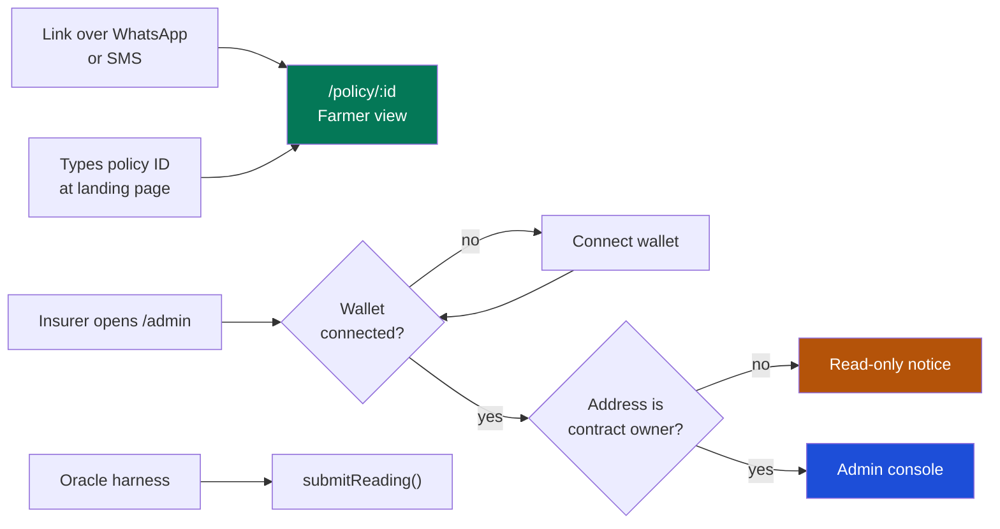
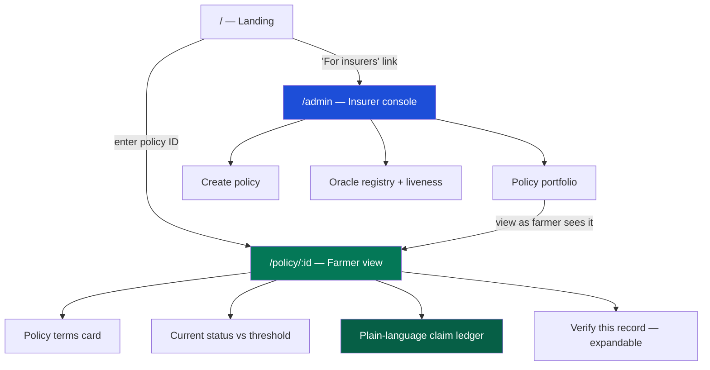
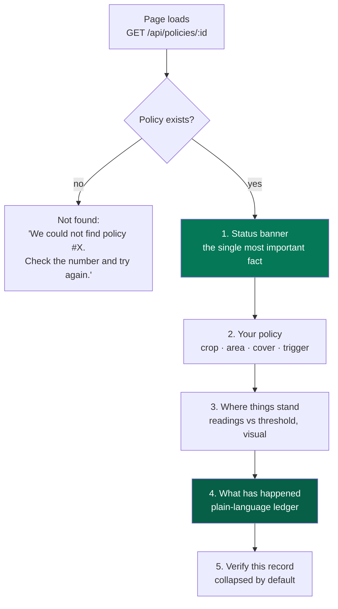
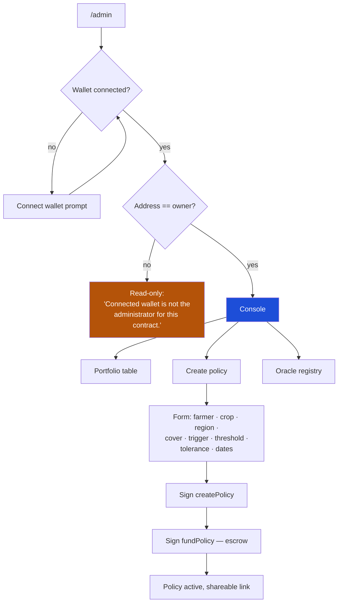
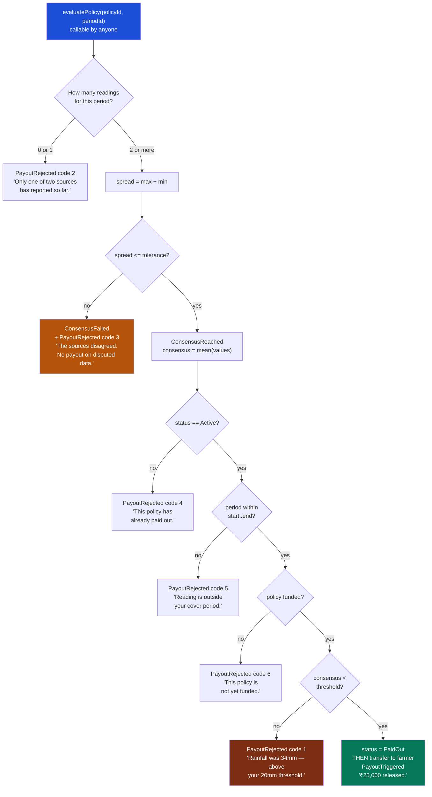
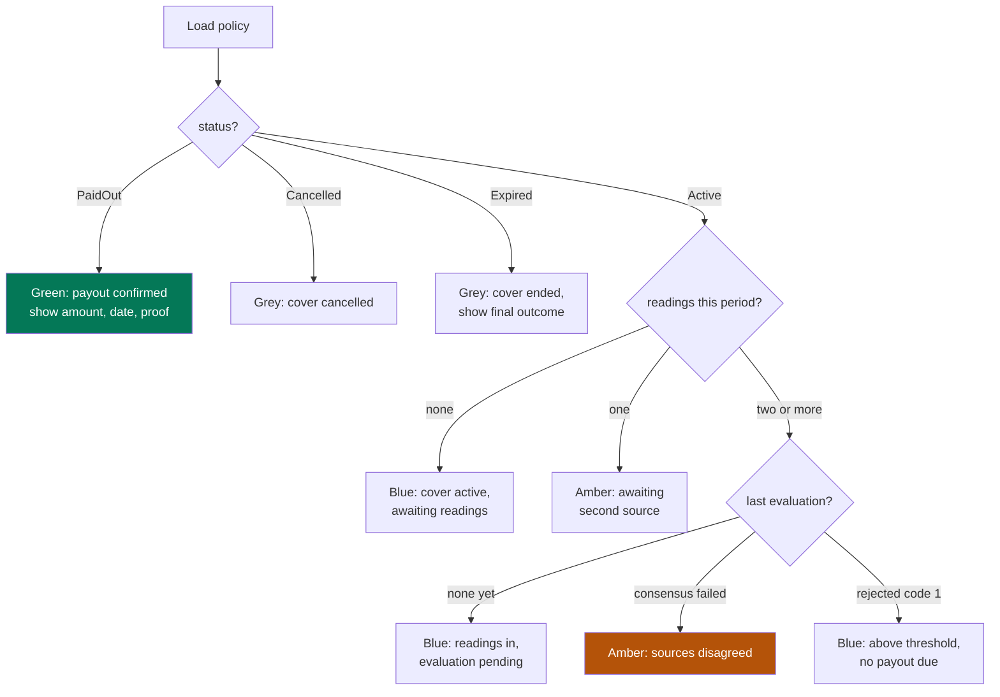
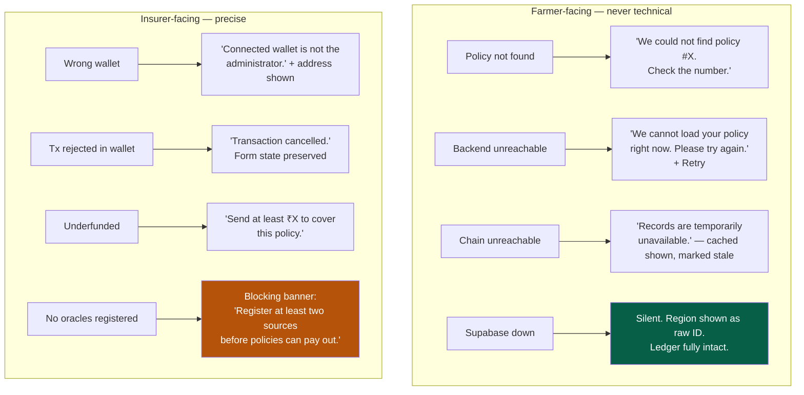
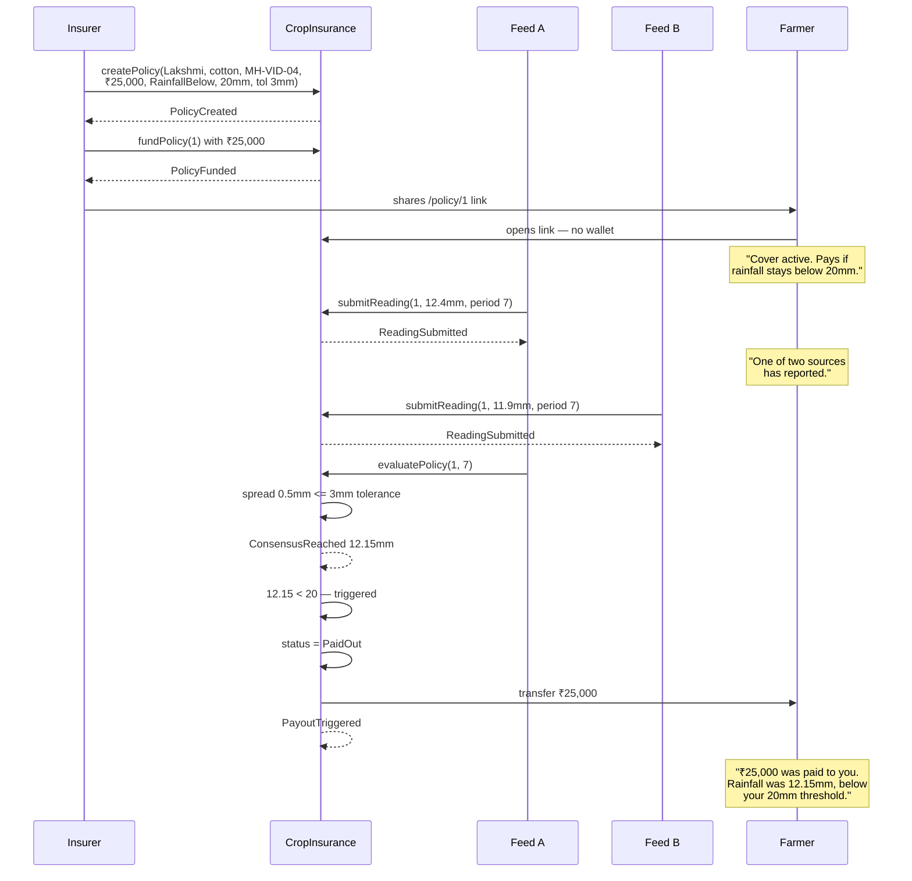
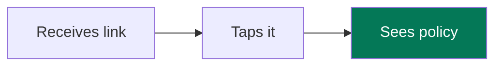
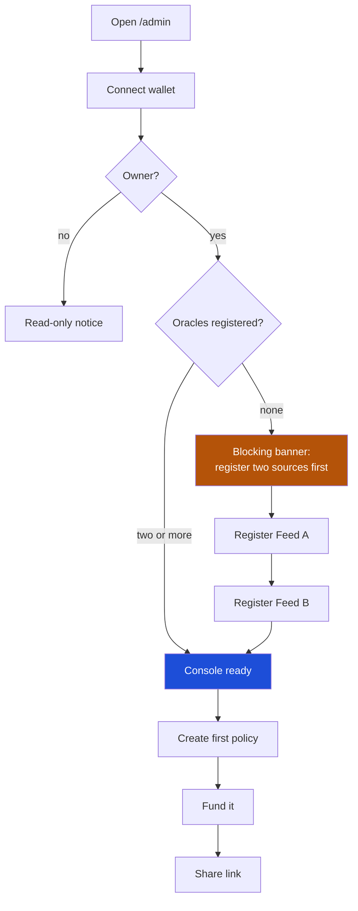

# User Flow Documentation — KisanShield

**Parametric Crop Insurance with Automatic Payout (PS3)**

| | |
|---|---|
| Document | User Flows |
| Version | 1.0 |
| Status | Approved — Phase 0 |
| Last updated | 2026-09-09 |
| Implements | [PRD.md](./PRD.md), [TRD.md](./TRD.md) |

---

## User Entry Points

Three actors reach the system by three different doors, with deliberately unequal friction.

| Actor | Entry point | Friction | Rationale |
|---|---|---|---|
| Farmer | `/policy/:id` link, or policy ID typed at `/` | **Zero** — no wallet, no login, no install | PRD G5. The farmer is the least technical actor and the one with the most at stake |
| Insurer | `/admin`, wallet connect | Wallet required | Administrative actions move money and must be signed |
| Oracle | `POST /api/oracle/simulate`, or a CLI script | Private key | Submissions are authorised by transaction signature |

The asymmetry is the design. The party who needs to *read* the truth pays no cost to do so; the parties who *write* it must prove who they are.

## Navigation Flow

Two navigation properties matter:

- **The farmer view is a leaf.** It has no onward navigation that could lose someone who arrived from a WhatsApp link. Everything relevant is on one page.
- **The admin can open any policy exactly as the farmer sees it.** The insurer can never claim ignorance of what the farmer was shown, and it costs nothing to build since the route is public.

## Screen Flow

### Farmer — `/policy/:id`

Single scrolling page, mobile-first, ordered by what the farmer wants to know soonest.

The status banner answers the only question the farmer actually arrived with, in one sentence, above the fold:

| Policy state | Banner |
|---|---|
| Active, no readings | "Your cover is active. No weather readings yet for this period." |
| Active, partial readings | "One of two weather sources has reported. We need both before deciding." |
| Active, readings above threshold | "Rainfall so far is 34mm. Your cover pays if it stays below 20mm." |
| Paid out | "₹25,000 was paid to you on 14 August 2026." |
| Rejected this period | "No payout for this period. Rainfall was 34mm — above your 20mm threshold." |
| Consensus failed | "The two weather sources disagreed. No payout was made on disputed data." |
| Expired | "This cover ended on 30 September 2026." |

### Insurer — `/admin`

Creation is deliberately two transactions. A policy that exists but is unfunded is a promise with nothing behind it; separating the steps makes the funding state explicit and visible rather than assumed, and the portfolio table flags any unfunded policy as an exception.

## Decision Trees

### The payout evaluation — the centrepiece

This tree is the product. Every terminating branch emits an event, so the ledger can explain any outcome rather than leaving the farmer to infer meaning from silence.

Three properties are load-bearing:

1. **Consensus is checked before anything else.** Disputed data never reaches the trigger comparison at all — the system refuses to decide rather than deciding on a number it cannot stand behind.
2. **Status is set before the transfer** (checks-effects-interactions), closing the reentrancy path.
3. **Strictly below.** `consensus < threshold` triggers; exactly equal does not. This is the difference between paying and not paying for one farmer, so it is fixed by a test rather than left to interpretation.

### Farmer view state resolution

Colour is always paired with text and an icon — never the sole carrier of state ([Design.md](./Design.md), NFR4).

## Error Flows

Two rules govern error copy:

- **Farmer errors are never technical.** No status codes, no stack traces, no contract addresses in the message body. A farmer who sees "RPC error" learns nothing and trusts less.
- **Supabase failure is invisible to the farmer.** Because off-chain data is non-authoritative (TRD, NFR10), its absence degrades presentation only — a region shows as `MH-VID-04` instead of "Vidarbha, Maharashtra". The ledger, the decisions, and the money are untouched. This is the visible payoff of the authority rule.

## Edge Cases

| # | Case | Handling |
|---|---|---|
| E1 | Consensus exactly equal to threshold | **No payout.** Strictly-below semantics; fixed by test |
| E2 | Three oracles registered, two agree and one diverges | Spread is max−min across *all* readings, so one outlier blocks consensus. Conservative by design; median-of-three is NH2 |
| E3 | Same oracle submits twice for one period | Second submission reverts. Prevents a single feed manufacturing agreement with itself |
| E4 | Oracle deregistered after submitting | Prior reading stands — it was validly submitted. Deregistration is not retroactive |
| E5 | `evaluatePolicy` called repeatedly | Idempotent. After payout, always `PayoutRejected(4)`; ledger shows one payout and does not spam duplicates |
| E6 | Farmer address is a contract that rejects transfers | Transfer fails, whole transaction reverts, status stays `Active`. Never a state where status says paid but funds did not move |
| E7 | Policy funded above coverage | Excess is escrowed and returned on cancel. No partial-refund path in scope |
| E8 | Cancel after payout | Reverts. Paid policies are terminal |
| E9 | Reading arrives after policy expiry | Recorded, but evaluation returns code 5. Data is never silently discarded |
| E10 | Farmer opens a policy that is not theirs | Renders. Policy data is public by design; PII is off-chain (SEC9) |
| E11 | Two evaluations in one block | Second sees `PaidOut` from the first. Sequential execution makes this safe |
| E12 | `deployment.json` missing or stale | Backend `config.ts` returns `null`; health reports it. Most likely demo-day failure, so it is explicitly diagnosable |
| E13 | Policy created with `endDate` before `startDate` | Reverts at creation. Invalid terms never enter the system |
| E14 | Zero coverage amount | Reverts. A policy that cannot pay is not a policy |

## Success Flows

### Primary — trigger met, automatic payout

The demo script, end to end.

No human approved anything between the second reading and the money arriving. That absence is the product.

### Secondary — threshold not met

Feeds agree at 34.2mm and 33.8mm. Consensus 34.0mm, above the 20mm threshold. `PayoutRejected(1)`. The farmer sees: *"No payout for this period. Rainfall was 34mm — above your 20mm threshold. Your cover remains active."*

This flow is not a failure case. A farmer who can see why they were *not* paid — with the actual number, against the threshold they agreed to — has been given something the current system does not provide.

### Tertiary — oracles disagree

Feed A reports 11.9mm; Feed B reports 31.4mm. Spread 19.5mm exceeds the 3mm tolerance. `ConsensusFailed`, `PayoutRejected(3)`. No funds move.

The farmer sees: *"The two weather sources disagreed about rainfall in your area (12mm and 31mm). No payout was made on disputed data. This has been recorded and will be reviewed."*

This is the answer to "why not just a database". A single-source system would have paid out or refused on one unverifiable number, with no trace. Here the disagreement is itself a permanent public record, and neither the insurer nor either feed can quietly resolve it in their own favour.

## Onboarding Flow

### Farmer — there is no onboarding

No account, no install, no tutorial, no wallet. The absence of an onboarding flow is the feature (PRD G5), and it is enforced structurally: the farmer route does not import wagmi, so a wallet prompt cannot appear on it (TRD, PERF5).

First-time comprehension is carried by the page itself — plain language, one banner sentence answering the arriving question, and a "How does this work?" expandable explaining parametric cover in four sentences without the words *blockchain*, *smart contract*, or *oracle*.

### Insurer — first-run setup

The oracle-registration gate is blocking rather than advisory. A policy created before two feeds exist can never pay out — evaluation would return code 2 forever — and discovering that after a farmer has been told they are covered is the worst possible failure. The guard makes the two-source requirement felt during setup rather than during a claim.

---

## Related documents

- [PRD](./PRD.md) — requirements and personas
- [TRD](./TRD.md) — architecture, contract spec, reason codes
- [Design](./Design.md) — visual system and components
- [Schema](./Schema.md) — data model
- [Implementation Plan](./ImplementationPlan.md) — phased tasks
- [Tracker](../TRACKER.md) — project state
